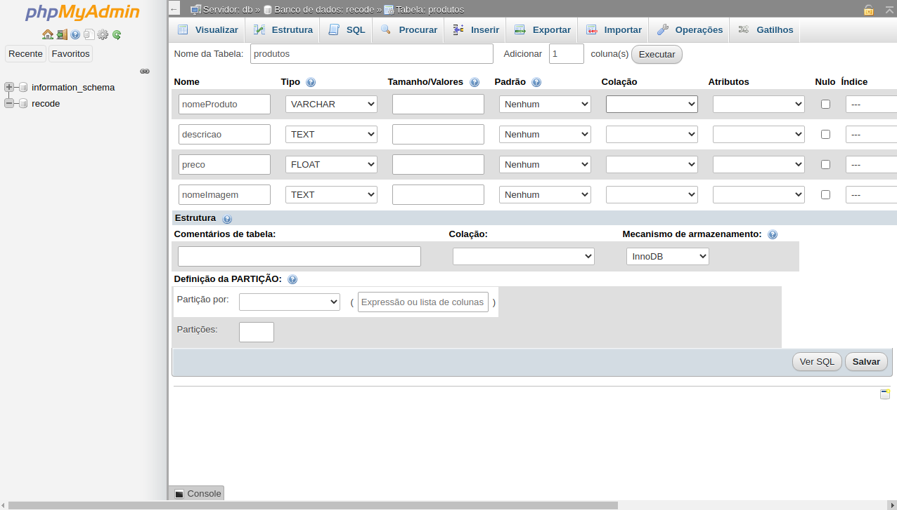
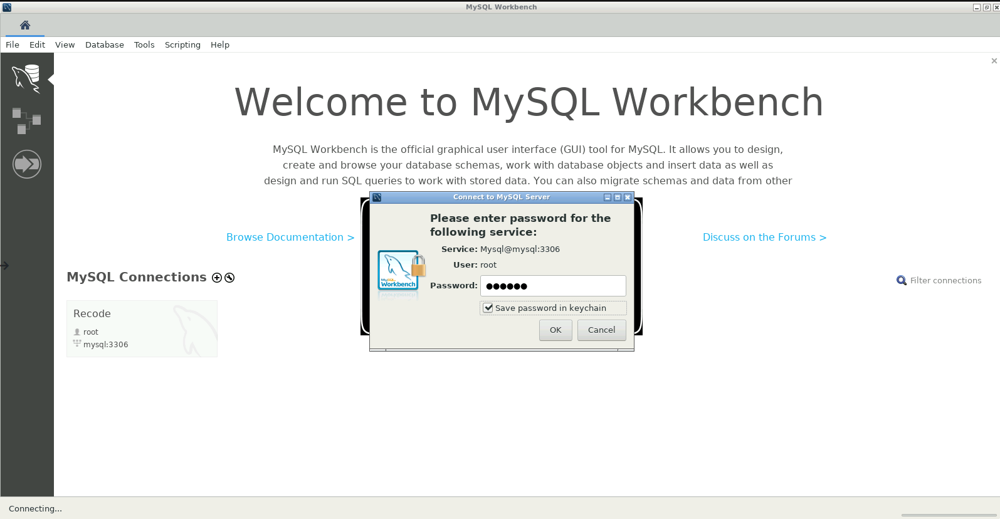

# CRUD Básico PHP
<a href="#php">1. Clique aqui para ver como usar o projeto</a>
 
<a href="#docker">2. Clique aqui para ver instala o Docker e o Banco de Dados MySQL</a>

  

<h2>CRUD Básico com PHP</h2>
<b>Para usar o projeto, você precisa ter o MySQL, Apache e PHP instalado em usa maquina!</b>
  

CRUD são as quatro operações básicas utilizadas em bases de dados relacionais  

<b>C</b>reate = (Criar algo no banco de dados)

<b>R</b>ead = (Ler algo no banco de dados)

<b>U</b>pdate = (Atualizar algo no banco de dados)

<b>D</b>elete = (Deletar algo no banco de dados)

  

<h3>Se você está usando o Docker disponibilizado aqui:</h3>
Você só precisa seguir os procedimentos do Docker abaixo e quando terminar, abra seu navegador em <a href="http://localhost">Localhost</a> e está pronto para usar!

  

<h3>Se você está usando outras maneiras</h3>
Considerando que seu ambiente já está pronto para utilização.
Copie todos os arquivos da pasta <i>php</i> e cole na pasta do apache, após isso, abra seu navegador em <a href="http://localhost">Localhost</a> e está pronto para usar!

  

<h2>1. Instalar o Docker</h2>
<a href="https://blog.qaninja.io/instalando-o-docker/">Como instalar no Ubuntu / Mac / Windows</a>

<h2> 2. Instalar o Docker Compose</h2>
<a href="https://www.digitalocean.com/community/tutorials/how-to-install-docker-compose-on-ubuntu-18-04-pt"> Como instalar no Ubuntu</a>

No Windows / Mac a instalação é junto com o docker!</a>

<h2> 3. Execute o script</h2>

Dentro da pasta existe um arquivo chamado <b><i>docker_compose.yml</b></i>

No terminal de comandos do seu PC: 

1. execute o comando <b><code>docker-compose up -d</code></b> e aguarde o download e quando aparecer DONE significa que está rodando!.

OBS: Existe um log, caso queira ver, escreva no terminal o comando <b><code>docker-compose logs </code></b>

Para encerrar, escreva no terminal o comando <b><code>docker-compose down </code></b>

 

<b>Para apagar tudo do seu computador, escreva no terminal os comandos:</b>

<ol>
    <li><b><code>docker-compose down </code></b></li>
    <li><b><code>docker rmi -f $(docker images -aq) </code></b></li>
    <li><b><code>docker rm - f $(docker ps -aq) </code></b></li>
    <li><b><code>docker volume prune -f </code></b></li>
    <li><b><code>docker system prune -f </code></b></li>
</ol>

<h2> 4. Utilização</h2>

Existem 3 serviços ao seu dispor:

<ul>
    <li>MySQL - Banco de Dados Relacional</li>
    <li><a href="#phpmyadmin">phpMyAdmin - Gerenciador do Banco</a></li>
    <li><a href="#workbench">MySQL Workbench - Outro Gerenciador do Banco</a></li>
</ul>

O MySQL é um serviço de segundo plano, ou seja, apenas aplicativos de primeiro plano conseguem utilizar e é ai que entra o phpMyAdmin

<h2 id="phpmyadmin">Para utilizar o phpMyAdmin, abra no seu navegador: <a href="http://localhost:8080">http://localhost:8080/</a></h2>
 
<h3>Você vai ver uma tela semelhante a esta abaixo</h3>

<h3>1. Para acessar o banco de dados, use as seguintes informações: </h3>
<ul>
    <li>Servidor: mysql</li>
    <li>Usuário: recode</li>
    <li>Senha: recode</li>
</ul>

<h3>2. Entre no banco de dados chamado <b><code>recode</code></b></h3>

<h3>3. Crie suas tabelas</h3>

   
<h2 id="workbench">Para utilizar o MySQL Workbench, abra no seu navegador: <a href="http://localhost:3000">http://localhost:3000/</a></h2>
 
<h3>1. Você vai ver uma tela semelhante a esta abaixo</h3>

 
Selecione a caixinha e clique em OK

 

<h3>2. Para acessar o banco de dados, use as seguintes informações: </h3>
<ul>
    <li>Connection Name: Recode</li>
    <li>Hostname: mysql</li>
    <li>Username: root</li>
</ul>

Clique em OK

 

 
<h3>3. Entre no banco de dados criado: <b><code>Recode</code></b> e digite a senha</h3>
<ul>
    <li>Em todas os inputs, digite: <b>recode</b></li>
</ul>

<h3>4. Pronto para realizar as tarefas</h3>

  

